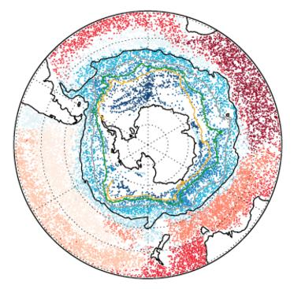

# Demonstration: Gaussian mixture modelling
Unsupervised classification is a type of machine learning that attempts to identify sub-populations in a data distribution. This repository is an example of using Gaussian mixture modelling, an unsupervised classification method, to identify profile types or "classes" of vertical temperature profiles within a larger profile dataset. Here, a "profile" is a set of measurements in the vertical direction at a particular longitude and latitude. 

This repository contains two small Argo float datasets, each containing about 1% of the total Southern Ocean profiles (up to early 2017). It also contains a Jupyter notebook that illustrates the application of GMM to the Argo temperature dataset. 

The clusters derived using GMM can be used to create maps of spatially coherent "profile types", as shown in the example plot below. (This is an additional feature not currently shown in this repository).

## Data description
There are two CSV files in this repository:
- Temperature profiles: Argo_T_profiles_very_small_subset.csv  [units °C]
- Salinity profiles: Argo_S_profiles_very_small_subset.csv  [practical salinity units, psu]

Each row represents a single Argo profile. The columns are variables associated with that profile, specifically:
- x : longitude (°E)
- y : latitude (°N)
- Temperature (°C) or salinity (psu) values at the indicated pressure levels (dbar)

Pressure is a commonly-used vertical coordinate for oceanographic data, in part because it can be directly measured by instruments while they are in the ocean. When reported in dbar, pressure values are somewhat close to depth values reported in metres. 

## Procedure
The demo procedure is described in the Jupyter notebook contained in this repository. See that file for further instructions.
